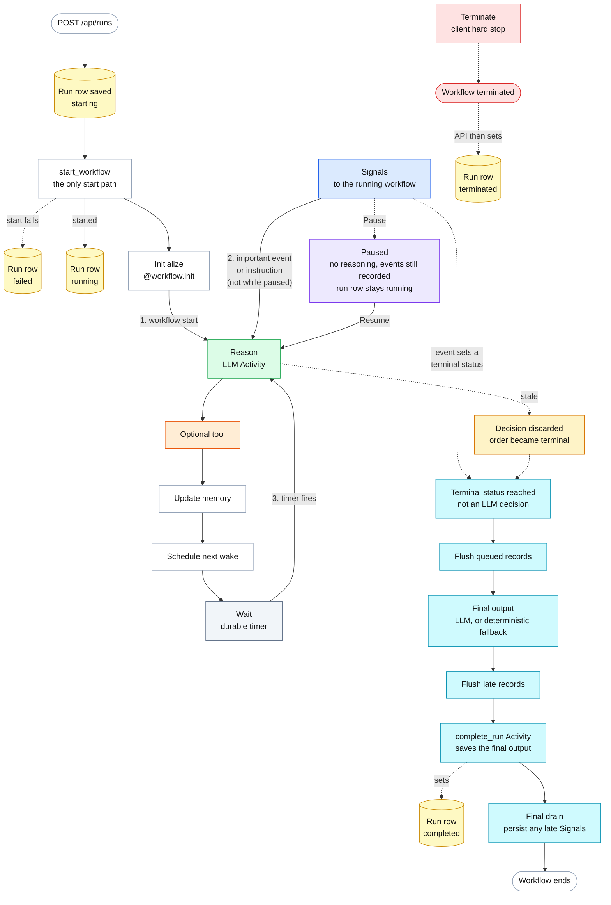
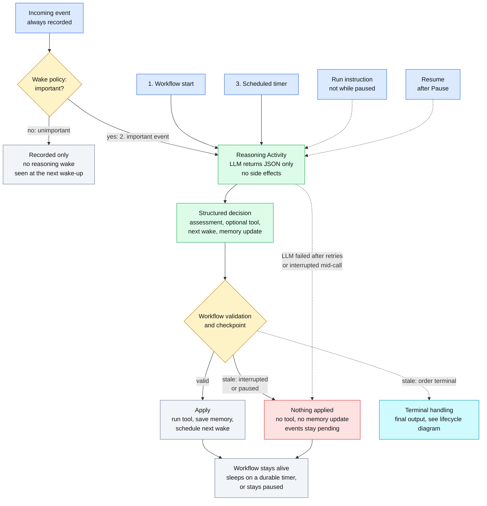

# Architecture note

A short description of how Order Supervisor is built and why. It describes the code as implemented. For setup and usage see the [README](README.md).

## In one paragraph

Each order gets one durable Temporal workflow (`OrderWorkflow`, id `order-{order_id}`). FastAPI starts it once when a run is created and afterwards only signals, queries or terminates it. Order events, run instructions and human controls arrive as Signals. The workflow is deterministic: it records everything, decides *when* the supervisor should reason, and sleeps on a durable timer in between. Reasoning is an Activity that asks an LLM for a strict JSON decision. The workflow validates that decision itself and runs at most one tool through another Activity. The LLM never causes a side effect. A run ends when the order reaches a configured terminal status (not because the LLM says so), and the workflow then writes a final report. A human can also hard-terminate it.

## Responsibilities

| Part | Responsibility |
|---|---|
| Temporal | Durable orchestration: workflow lifecycle, Signals, timers, compact workflow state. |
| `OrderWorkflow` | Decides when to reason and what may happen. No I/O, no randomness; time only through Temporal. |
| Activities | Everything non-deterministic: LLM calls, PostgreSQL writes, tool execution. |
| PostgreSQL | Queryable application history (supervisors, runs, events, timeline, actions, tool executions, memory snapshots, final output) and the mock operational tables the tools act on. 11 tables. |
| LLM | Structured reasoning only. Returns JSON; no side effects. |
| FastAPI | Thin boundary over PostgreSQL and the Temporal client. |
| Next.js | The UI. The browser talks only to Next.js; Server Components read from FastAPI and Server Actions write to it. |

## Workflow lifecycle

One workflow per order. The loop never spins: it either reasons once or waits on a durable timer.

- **Two lifecycles.** The Temporal workflow and the run's status row in PostgreSQL are separate. The API writes `starting` before contacting Temporal, then `running` (or `failed` if the start fails). The workflow's `complete_run` Activity writes `completed`; the API writes `terminated` after a hard stop. Pause is workflow state only, so the row stays `running`.
- **Start.** `POST /api/runs` is the only place a workflow starts. An incoming event can never start one, and the application does not use Signal-With-Start. State is initialised in `@workflow.init`, so even a Signal delivered in the very first activation sees the configuration.
- **Terminal handling.** When an event moves the order to a terminal status: flush queued records, generate the final output (LLM, or a deterministic fallback), flush again, run `complete_run`, drain any late Signals, end. Late Signals are persisted but cannot reopen the workflow.

## Wake and reasoning model

Reasoning has three triggers from the assignment (workflow start, an important event, a scheduled wake-up). A run instruction and Resume also wake the supervisor.

- **Wake policy** is a fixed rule per supervisor: an event wakes the supervisor only if its type is in `important_event_types`, the supervisor is not paused, the order is not terminal and no wake is already queued. Every event is recorded either way, and unimportant ones are seen at the next wake.
- **The LLM proposes, the workflow disposes.** The workflow discards a decision made stale by an interrupt, a pause or a terminal status. Otherwise it re-checks the tool against the fixed registry and the supervisor's enabled tools, allows one tool with its required inputs, and clamps the next wake to the supervisor's minimum and maximum.
- **A failed or interrupted cycle never ends the workflow.** No tool runs, no memory is saved, pending events stay pending, and the supervisor tries again at its next wake.

## Memory, timeline and database

| | What it is | Where it lives |
|---|---|---|
| Memory | A compact working summary (summary up to 1000 characters, up to 5 open concerns), rewritten every cycle and given to the LLM. Lossy by design. | Workflow state, plus one `memory_snapshots` row per applied cycle |
| Timeline | The complete human-readable history of events, decisions, actions, controls and system notes. Never sent whole to the LLM. | `timeline_entries` |
| PostgreSQL | Queryable history the UI reads. | 11 tables |
| Temporal history | Orchestration state for replay: pending events, the 20 most recent events, memory, next wake, control flags. | Temporal |

## Human controls

- **Pause** stops reasoning but keeps the workflow alive; events and instructions are still recorded. **Resume** wakes the supervisor to re-evaluate what was recorded.
- **Interrupt** drops the current cycle. An in-flight LLM call is abandoned; a tool that already started is allowed to finish and is recorded.
- **Terminate** is Temporal's client-side hard stop, not a Signal. It produces no final output.
- **Extra instructions** are a Signal stored with the run, included in every later reasoning input.

## Reliability

| Operation | Timeout | Retries | Why |
|---|---|---|---|
| Persistence Activities | 10 s | 5 attempts | Idempotent (ids come from the workflow, inserts use `ON CONFLICT`). |
| Reasoning (LLM) | 60 s | 3 attempts | Transient provider errors and invalid output are worth another try. |
| Final output (LLM) | 90 s | 3 attempts | Same, with a larger budget. A failure falls back to a deterministic report. |
| Read tools | 10 s | 3 attempts | No side effect. |
| Side-effect tools | 10 s | exactly 1 attempt | A retry could duplicate an escalation or a customer message. |

The LLM client's own timeout is 45 s with SDK retries off, so it fails before the Activity timeout and Temporal owns all retrying.

## Key decisions

- **One workflow per order.** The order is the natural unit of state; PostgreSQL also enforces one run per order.
- **Temporal for orchestration, PostgreSQL for history.** Temporal's history is for replay, not for queries.
- **Signals for everything that changes a live run.** Handlers only update state and queue records; the main loop persists them.
- **Side effects only in Activities.** Workflow code must replay deterministically.
- **Structured JSON from the LLM, validated twice.** Once in the Activity against a strict schema, and again in the workflow.
- **Rule-based wake policy.** Deterministic and cheap; the assignment allows a simple policy.
- **Terminal is not an LLM decision.** It comes from the supervisor's event-to-status mapping.
- **Immutable supervisors.** Creating a supervisor with an existing name creates the next version, so a run's configuration cannot change under it.
- **Server Actions for browser writes.** The backend needs no CORS configuration.

## Scope boundaries

Deliberately out of scope for this proof of concept: real commerce or messaging integrations, authentication, production hardening, `continue_as_new`, an LLM wake classifier, WebSockets, and a supervisor list or edit flow. The tools are mocks over PostgreSQL tables that are not seeded by the UI. See [Limitations](README.md#limitations).
